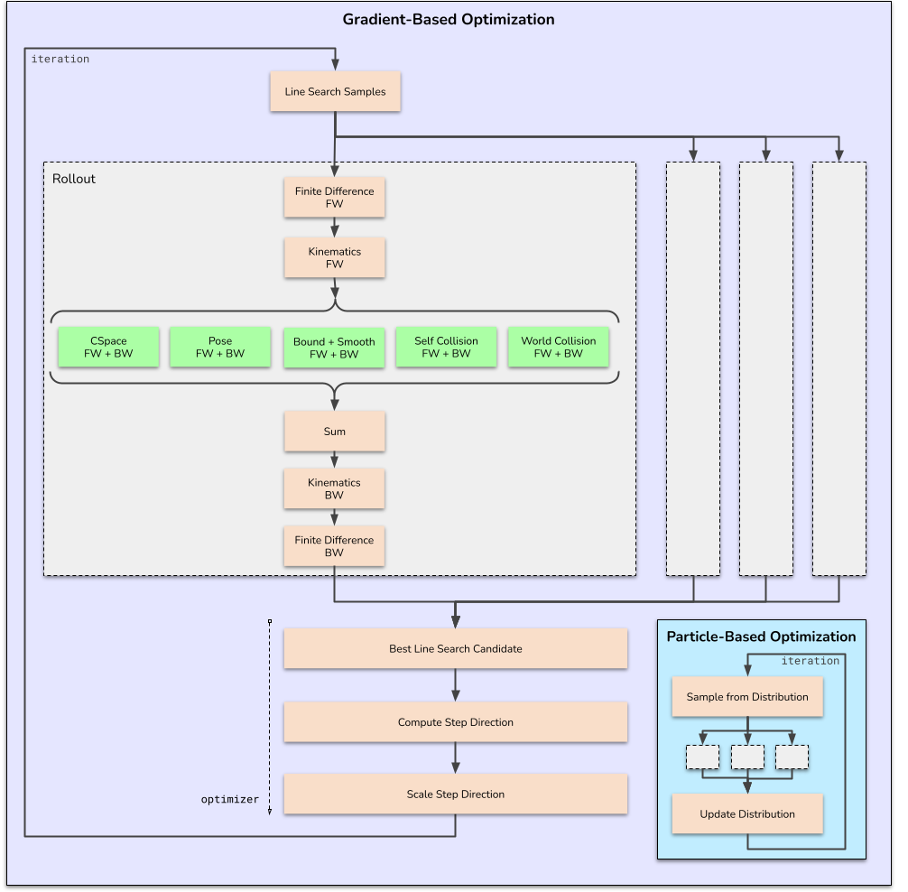

.. _optimization_solver_note:

Optimization Solvers
================================

cuRobo implements a family of optimization solvers that operate on any class satisfying the
:py:class:`~curobo._src.rollout.rollout_protocol.Rollout` Protocol (see
:ref:`rollout_class_note`) to minimize costs and constraints. Every solver accepts a rollout
that maps ``[batch, horizon, dof]`` actions to ``[batch, horizon]`` cost, and every solver
itself satisfies the :py:class:`~curobo._src.optim.optimizer_protocol.Optimizer` Protocol.
There is no shared base class -- solvers are standalone classes that compose a small set of
reusable components.

The solvers fall into three broad categories:

1. **Gradient-based solvers** (:py:mod:`curobo._src.optim.gradient`) -- use the rollout's
   gradient to take Newton-ish steps with a parallel line search.
2. **Particle-based solvers** (:py:mod:`curobo._src.optim.particle`) -- sample actions from a
   Gaussian distribution and update the distribution from the cost statistics.
3. **External solvers** (:py:mod:`curobo._src.optim.external`) -- delegate the outer loop to
   :py:class:`~curobo._src.optim.external.scipy_opt.ScipyOpt` (SciPy) or
   :py:class:`~curobo._src.optim.external.torch_opt.TorchOpt` (``torch.optim``) while still
   evaluating costs and gradients on the GPU through the cuRobo rollout.

Multiple solvers can be chained into a single solve via
:py:class:`~curobo._src.optim.multi_stage_optimizer.MultiStageOptimizer`, which itself
implements the ``Optimizer`` Protocol (see :ref:`chaining-optimizers` below).

.. graphviz::
    :caption: Optimizer Protocol and the composition of its concrete implementations

    digraph {
        edge [color="#2B4162", fontsize=10];
        node [shape="box", style="rounded, filled", fontsize=12, color="#cccccc"];

        // Interface node (dotted border).
        optimizer [
            label="Optimizer\n(Protocol, interface only)",
            shape="box",
            style="rounded, dashed",
            color="#76b900",
            fontcolor="#2B4162"
        ];

        subgraph cluster_gradient {
            label="Gradient-Based Optimizers";
            style="rounded, dashed";
            color="#558c8c";

            lbfgs   [label="LBFGSOpt",             color="#76b900", style="filled, rounded", fontcolor="white"];
            lsr1    [label="LSR1Opt",              color="#76b900", style="filled, rounded", fontcolor="white"];
            cg      [label="ConjugateGradientOpt", color="#76b900", style="filled, rounded", fontcolor="white"];
            gd      [label="GradientDescentOpt",   color="#76b900", style="filled, rounded", fontcolor="white"];
        }

        subgraph cluster_particle {
            label="Particle-Based Optimizers";
            style="rounded, dashed";
            color="#558c8c";

            mppi    [label="MPPI",                 color="#76b900", style="filled, rounded", fontcolor="white"];
            es      [label="EvolutionStrategies",  color="#76b900", style="filled, rounded", fontcolor="white"];
        }

        subgraph cluster_external {
            label="External Optimizers";
            style="rounded, dashed";
            color="#558c8c";

            scipy_opt [label="ScipyOpt", color="#ff9900", style="filled, rounded", fontcolor="white"];
            torch_opt [label="TorchOpt", color="#ff9900", style="filled, rounded", fontcolor="white"];
        }

        subgraph cluster_meta {
            label="Chaining";
            style="rounded, dashed";
            color="#558c8c";

            multi [label="MultiStageOptimizer", color="#ff9900", style="filled, rounded", fontcolor="white"];
        }

        subgraph cluster_components {
            label="Shared Components (composed, not inherited)";
            style="rounded, dashed";
            color="#934337";

            gradient_core [label="GradientOptCore",    color="#cccccc", fontcolor="black"];
            particle_core [label="ParticleOptCore",    color="#cccccc", fontcolor="black"];
            qn            [label="QuasiNewtonBuffers", color="#cccccc", fontcolor="black"];
            best          [label="BestTracker",        color="#cccccc", fontcolor="black"];
            gauss         [label="GaussianDistribution", color="#cccccc", fontcolor="black"];
            bounds        [label="ActionBounds",       color="#cccccc", fontcolor="black"];
            debug         [label="DebugRecorder",      color="#cccccc", fontcolor="black"];
        }

        // "Implements" edges from each optimizer to the Optimizer protocol.
        {lbfgs, lsr1, cg, gd, mppi, es, scipy_opt, torch_opt, multi}
            -> optimizer [label="implements", style="dashed", fontcolor="#2B4162"];

        // "Composes" edges from each optimizer to the components it owns.
        lbfgs   -> {gradient_core, qn}      [label="composes"];
        lsr1    -> {gradient_core, qn}      [label="composes"];
        cg      -> {gradient_core}          [label="composes"];
        gd      -> {bounds, best, debug}    [label="composes"];

        mppi    -> {particle_core}          [label="composes"];
        es      -> {particle_core}          [label="composes"];
        particle_core -> {gauss, bounds, debug} [label="composes"];

        scipy_opt -> {bounds, debug}        [label="composes"];
        torch_opt -> {bounds, debug}        [label="composes"];

        // MultiStageOptimizer chains other optimizers, it does not compose
        // the lower-level buffer components itself.
        multi -> {lbfgs, mppi} [label="stages", style="dashed"];
    }

Gradient-Based Optimization Solvers
-----------------------------------

The gradient-based solvers that cuRobo implements use a parallel line search strategy on the GPU
to find the minimum instead of a sequential line search strategy (e.g., backtracking line search).
At every iteration of a line-search based optimization solver, cuRobo performs the following steps:

1. Compute the cost and gradient of the current action.
2. Compute a step direction based on the gradient (and possibly other information).
3. Perform a line search to find the best step size along the step direction.
4. Update the action using the step direction and step size.
5. Repeat until convergence or maximum iterations reached.

The specific implementation details vary depending on the optimization algorithm being used (LBFGS, CG, etc.).

Line Search Optimization
^^^^^^^^^^^^^^^^^^^^^^^^

1. Compute the best step magnitude using line search from the current action and step direction (from previous iteration).
2. Store the best action and gradient.
3. Compute the new step direction using the gradient of the best action.

.. digraph:: LineSearchOptimization
   :align: center
   :caption: Line Search Optimization Iteration

   node [shape="box", style="filled", color="#76b900", fontcolor="white", fontname="sans-serif"];
   edge [color= "#aaaaaa" , fontname="sans-serif", fontsize=10, style="dashed"];

   subgraph cluster_input {
      label="Input to Iteration\n OptimizationIterationResult";
      style="rounded, dashed";
      color="#558c8c";

      current_action [label="current_action", shape="box", color="#cccccc", style="filled", fontcolor="black"];
      step_direction [label="step_direction", shape="box", color="#cccccc", style="filled", fontcolor="black"];
   }
   compute_best_step [label="compute_best_step\nusing line search"];
   compute_cost_gradient [label="Rollout.evaluate_action"];
   compute_best_step -> compute_cost_gradient [dir="both"];
   subgraph cluster_output {
      label="Output of Iteration\n OptimizationIterationResult";
      style="rounded, dashed";
      color="#558c8c";

      next_action [label="next_action", shape="box", color="#cccccc", style="filled", fontcolor="black"];
      next_cost [label="next_cost", shape="box", color="#cccccc", style="filled", fontcolor="black"];
      next_gradient [label="next_gradient", shape="box", color="#cccccc", style="filled", fontcolor="black"];
   }
   store_best [label="store_best_action"];
   compute_direction [label="compute_step_direction"];
   new_direction [label="new_step_direction", shape="box", color="#cccccc", style="filled", fontcolor="black"];

   {current_action, step_direction} -> compute_best_step;
   compute_best_step -> {next_action, next_cost, next_gradient};
   {next_action, next_gradient, next_cost} -> store_best;
   {next_action, next_gradient, next_cost} -> compute_direction;
   compute_direction -> new_direction;
   next_action -> current_action [label="Next Iteration", color= "#000000", style="solid"];
   new_direction -> {step_direction} [label="Next Iteration", color= "#000000", style="solid"];

Particle-Based Optimization Solvers
-----------------------------------

Particle-based solvers sample a batch of candidate actions from a Gaussian distribution over the
action sequence, score each sample with the rollout, and update the distribution from the
cost-weighted statistics. cuRobo ships two particle solvers:

- :py:class:`~curobo._src.optim.particle.mppi.MPPI` -- Model-Predictive Path Integral control.
  Computes exponential-utility weights
  (``w ∝ exp(-beta * cost)``) and takes an exponentially-moving-average step on the
  distribution mean and covariance. The ``beta`` temperature is the primary tuning knob for the
  exploration/exploitation trade-off.
- :py:class:`~curobo._src.optim.particle.evolution_strategies.EvolutionStrategies` -- a natural-
  gradient evolution-strategies solver that uses z-score-normalised cost weights and a
  configurable ``learning_rate`` for the mean update.

Both solvers share the same hot loop: they compose a
:py:class:`~curobo._src.optim.components.particle_opt_core.ParticleOptCore`, which owns the
:py:class:`~curobo._src.optim.components.gaussian_distribution.GaussianDistribution`,
:py:class:`~curobo._src.optim.components.action_bounds.ActionBounds`, and
:py:class:`~curobo._src.optim.components.debug_recorder.DebugRecorder`, and drives sampling,
rollout evaluation, and weight computation. The solvers differ only in their
distribution-update function; everything else is reused through composition.

External Optimization Solvers
-----------------------------

External solvers delegate the optimizer loop to a third-party library while still evaluating
costs, constraints, and gradients on the GPU through the cuRobo rollout. Both external solvers
compose :py:class:`~curobo._src.optim.components.action_bounds.ActionBounds` (for projecting and
scaling actions) and :py:class:`~curobo._src.optim.components.debug_recorder.DebugRecorder` (for
optional per-iteration traces).

Scipy Optimization
^^^^^^^^^^^^^^^^^^

The :py:class:`~curobo._src.optim.external.scipy_opt.ScipyOpt` solver wraps
``scipy.optimize.minimize``. On each iteration it:

1. Computes costs, constraints, and gradients on the GPU via the rollout.
2. Transfers the scalar cost and gradient to CPU.
3. Hands control to SciPy (e.g. ``L-BFGS-B`` or ``SLSQP``) to produce the next action.

The method is selected through ``scipy_minimize_method`` on
:py:class:`~curobo._src.optim.external.scipy_opt.ScipyOptCfg`. Constraint-aware methods like
``SLSQP`` automatically receive cuRobo constraints as inequality constraints, and the action is
converted to ``float64`` on CPU for numerical stability.

Torch Optimization
^^^^^^^^^^^^^^^^^^

The :py:class:`~curobo._src.optim.external.torch_opt.TorchOpt` solver wraps any optimizer from
:py:mod:`torch.optim` (e.g. Adam, SGD, LBFGS). It computes the cost via the rollout,
backpropagates through the computation graph, and delegates the parameter update to the wrapped
PyTorch optimizer. The specific optimizer class is selected by
:py:attr:`~curobo._src.optim.external.torch_opt.TorchOptCfg.torch_optim_name` (looked up in
``torch.optim``) or by passing an explicit
:py:attr:`~curobo._src.optim.external.torch_opt.TorchOptCfg.torch_optim_class`. Unlike the
gradient-based solvers above, ``TorchOpt`` does not use cuRobo's parallel line search -- the
wrapped PyTorch optimizer owns the step-size logic.

.. _chaining-optimizers:

Chaining Optimization Solvers
-----------------------------

cuRobo chains solvers through
:py:class:`~curobo._src.optim.multi_stage_optimizer.MultiStageOptimizer`, which itself satisfies
the :py:class:`~curobo._src.optim.optimizer_protocol.Optimizer` Protocol. Each stage runs to
completion and its output is fed as the seed for the next. This is how
:class:`curobo.inverse_kinematics.InverseKinematics` and
:class:`curobo.trajectory_optimizer.TrajectoryOptimizer` are wired: a random seed is first
optimized by :py:class:`~curobo._src.optim.particle.mppi.MPPI` for global exploration, and the
resulting distribution mean is handed to
:py:class:`~curobo._src.optim.gradient.lbfgs.LBFGSOpt` for local refinement.

.. graphviz::

   digraph {
        #rankdir=LR;
        edge [color = "#2B4162"; fontsize=10];
        node [shape="box", style="rounded, filled", fontsize=12, color="#cccccc"]
        seed [label="random seed"]
        opt_sol [label="optimized solution", shape="plain", style="rounded"]
        subgraph cluster_query{
        label="Query";
        start [label="Current State"]
        goal [label="Goal Pose"]

        }

        subgraph cluster_robot{
        label="Robot World Configuration";
        kin_model [label="RobotCfg", color="#76b900",fontcolor="white"]

        world_model [label="SceneCollision", color="#76b900",fontcolor="white"]
        }

        kin_model -> mppi_rollout [style="dashed", fontcolor="#708090", label="reference"];
        world_model -> mppi_rollout [style="dashed", fontcolor="#708090", label="reference"];
        seed -> mppi_solver [color="#76b900"];
        start -> mppi_rollout [style="dashed"];
        goal -> mppi_rollout [style="dashed"];
        start -> lbfgs_rollout [style="dashed"];
        goal -> lbfgs_rollout [style="dashed"];

        kin_model -> lbfgs_rollout [style="dashed", fontcolor="#708090", label="reference"];
        world_model -> lbfgs_rollout [style="dashed", fontcolor="#708090", label="reference"];

        mppi_solver -> mppi_sol [color="#76b900"];
        subgraph cluster_particle {
        label="Particle Optimization";
        mppi_solver[label = "Parallel MPPI"];
        mppi_rollout [label = "Rollout for MPPI"]
        mppi_sol[label="MPPI Solution"]
        mppi_rollout -> mppi_solver;
        }

        subgraph cluster_gradient {
        label="Gradient Optimization";
        lbfgs_solver[label = "LBFGS Solver"];
        lbfgs_rollout [label = "Rollout for L-BFGS"]
        lbfgs_sol [label = "LBFGS Solution"]
        lbfgs_rollout -> lbfgs_solver;

        }
        mppi_sol -> lbfgs_solver [color="#76b900"];
        lbfgs_solver -> lbfgs_sol [color="#76b900"];
        lbfgs_sol -> opt_sol [color="#76b900"];

   }

The steps inside the optimization solver is illustrated for reference. Gray blocks indicate running
rollout for 1 trajectory in the batch and green blocks refer to the cost terms.

