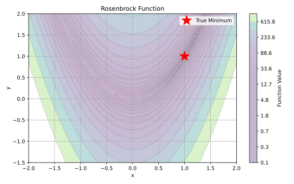
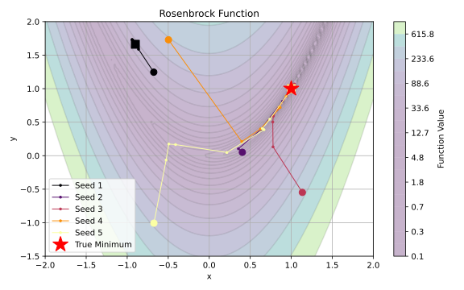

.. _tut_user_rollout_optimization:

Writing Optimization Problems
==============================
This tutorial will guide you through optimizing the Rosenbrock function using a custom rollout
class and plugging it into cuRobo's optimization pipeline.

cuRobo's optimization pipeline is designed to be modular and extensible. The optimization pipeline
consists of a rollout class and an optimization solver. The rollout class contains information
about the optimization problem, including evaluation of costs and constraints given the optimization
variables. The optimization solver is responsible for finding the optimal values by using the
rollout class for evaluations.

Required Reading
-----------------
- :ref:`rollout_class_note`
- :ref:`optimization_solver_note`

Rosenbrock Function
--------------------

The Rosenbrock function, also known as the banana function or Valley function, is a common test
problem for optimization algorithms. It is defined as:

.. math::

   f(x,y) = (1-x)^2 + 100(y-x^2)^2

The function has a global minimum at (1,1) where f(1,1) = 0. The function's name comes from its
characteristic shape - a parabolic valley. While finding the valley is trivial, converging to the
global minimum is difficult. The valley is very narrow and curved, making it a challenging
optimization problem that tests an algorithm's ability to navigate a narrow curved valley.

We want to go to the minimum from a random initial point.

Optimization solvers can get stuck in local minima. To overcome this, some solvers
randomly perturb when stuck. In cuRobo, we instead parallelize the optimization across multiple
starting points (seeds) and leverage GPU compute to find the best solution.

We will next implement a custom rollout class that can then be plugged into cuRobo's
optimization pipeline. If you are unfamiliar with cuRobo's Rollout class, see
:ref:`rollout_class_note` before continuing.

Implementing a Custom Rollout Class
-----------------------------------

In this section, we'll implement a custom rollout class for the Rosenbrock function. cuRobo
rollouts are defined **structurally** through the
:py:class:`~curobo._src.rollout.rollout_protocol.Rollout` :class:`~typing.Protocol` -- a rollout
is any class that exposes the right set of properties and methods. There is no base class to
inherit from. See :ref:`rollout_class_note` for the full Protocol.

The implementation has three parts:

1. **Configuration** -- a plain ``@dataclass`` holding parameters and dimensions. No
   ``BaseRolloutCfg`` parent; just a regular dataclass.
2. **Implementing the rollout class** -- a standalone class whose public surface matches the
   :py:class:`~curobo._src.rollout.rollout_protocol.Rollout` Protocol.
3. **Computing costs and constraints** -- implementing the Rosenbrock function inside the
   rollout's forward pass.

The full reference implementation lives at
:py:class:`~curobo._src.rollout.rollout_rosenbrock.RosenbrockRollout`; the snippets below mirror
it with short comments.

Let's start with the configuration dataclass:

.. code-block:: python

   from dataclasses import dataclass
   from typing import Dict, List, Optional

   import torch

   from curobo._src.rollout.metrics import (
       CostCollection,
       CostsAndConstraints,
       RolloutMetrics,
       RolloutResult,
   )
   from curobo._src.rollout.rollout_protocol import Rollout
   from curobo._src.state.state_joint import JointState
   from curobo._src.types.device_cfg import DeviceCfg

   @dataclass
   class RosenbrockCfg:
       """Configuration for the Rosenbrock rollout."""

       device_cfg: DeviceCfg
       a: float = 1.0
       b: float = 100.0
       dimensions: int = 2
       time_horizon: int = 1
       time_action_horizon: int = 1
       sum_horizon: bool = False
       sampler_seed: int = 1312

The dataclass holds the Rosenbrock parameters ``a`` and ``b``, the problem dimensionality, and
the usual cuRobo rollout fields (``device_cfg``, horizon length, ``sum_horizon``,
``sampler_seed``). Next, the rollout class itself. ``use_cuda_graph`` is a constructor
parameter -- there is no mixin or subclass needed for CUDA-graph acceleration:

.. code-block:: python

   class RosenbrockRollout:
       """Rollout that evaluates the Rosenbrock cost for optimizer testing.

       f(x, y) = (a - x)^2 + b(y - x^2)^2

       For higher dimensions, uses the generalized form:
       f(x) = sum_{i=1}^{n-1} [ (a - x_i)^2 + b(x_{i+1} - x_i^2)^2 ]
       """

       def __init__(self, config: RosenbrockCfg, use_cuda_graph: bool = False):
           self.a = config.a
           self.b = config.b
           self.dimensions = config.dimensions
           self.time_horizon = config.time_horizon
           self.time_action_horizon = config.time_action_horizon
           self.device_cfg = config.device_cfg
           self.sum_horizon = config.sum_horizon
           self.sampler_seed = config.sampler_seed

           self._use_cuda_graph = use_cuda_graph
           self._action_bound_lows = (
               torch.ones((self.action_horizon,), **self.device_cfg.as_torch_dict()) * -1.5
           )
           self._action_bound_highs = (
               torch.ones((self.action_horizon,), **self.device_cfg.as_torch_dict()) * 2.0
           )
           self._batch_size = 1

Next, the properties the :py:class:`~curobo._src.rollout.rollout_protocol.Rollout` Protocol
requires (``action_dim``, ``action_horizon``, ``action_bound_lows`` / ``action_bound_highs``,
``dt``, ``sum_horizon``):

.. code-block:: python

       @property
       def action_dim(self) -> int:
           return self.dimensions

       @property
       def action_horizon(self) -> int:
           return self.time_action_horizon

       @property
       def action_bound_lows(self) -> torch.Tensor:
           return self._action_bound_lows

       @property
       def action_bound_highs(self) -> torch.Tensor:
           return self._action_bound_highs

       @property
       def dt(self) -> float:
           return 1.0

The Rosenbrock rollout is time-independent, so ``dt`` is just ``1.0``. ``sum_horizon`` is set
from the config in ``__init__`` above.

The forward pass evaluates the Rosenbrock cost. ``evaluate_action`` is the hot loop used by the
optimizer on every iteration. The helper ``_compute_state_from_action_impl`` maps actions to
a ``JointState`` (for Rosenbrock the state is just the action), and
``_compute_costs_and_constraints_impl`` evaluates the generalised Rosenbrock sum:

.. code-block:: python

       def evaluate_action(self, act_seq: torch.Tensor, **kwargs) -> RolloutResult:
           batch_size = act_seq.shape[0]
           if batch_size != self._batch_size:
               self.update_batch_size(batch_size)
           state = self._compute_state_from_action_impl(act_seq)
           costs = self._compute_costs_and_constraints_impl(state, **kwargs)
           return RolloutResult(actions=act_seq, state=state, costs_and_constraints=costs)

       def _compute_state_from_action_impl(self, act_seq: torch.Tensor) -> JointState:
           # For Rosenbrock, the state is just the action.
           return JointState.from_position(act_seq)

       def _compute_costs_and_constraints_impl(
           self, state: JointState, **kwargs
       ) -> CostsAndConstraints:
           x = state.position  # shape: [batch, horizon, dimensions]
           costs_and_constraints = CostsAndConstraints()

           # 2D Rosenbrock term.
           term1 = (self.a - x[:, :, 0]) ** 2
           term2 = self.b * (x[:, :, 1] - x[:, :, 0] ** 2) ** 2
           rosenbrock_cost = term1 + term2

           # Higher-dimensional terms.
           for i in range(1, self.action_dim - 1):
               term1 = (self.a - x[:, :, i]) ** 2
               term2 = self.b * (x[:, :, i + 1] - x[:, :, i] ** 2) ** 2
               rosenbrock_cost += term1 + term2

           # CostCollection uses add(value, name); it is not a list of tensors.
           costs_and_constraints.costs.add(rosenbrock_cost.unsqueeze(-1), "rosenbrock")
           return costs_and_constraints

The Protocol also requires post-optimization metrics hooks and a handful of lifecycle methods.
For the Rosenbrock rollout these are short:

.. code-block:: python

       def compute_metrics_from_state(self, state: JointState, **kwargs) -> RolloutMetrics:
           costs = self._compute_costs_and_constraints_impl(state)
           convergence = costs.get_sum_cost(sum_horizon=False)
           return RolloutMetrics(
               costs_and_constraints=costs,
               feasible=costs.get_feasible(),
               state=state,
               convergence=convergence,
           )

       def compute_metrics_from_action(
           self, act_seq: torch.Tensor, **kwargs
       ) -> RolloutMetrics:
           self.update_batch_size(act_seq.shape[0])
           state = self._compute_state_from_action_impl(act_seq)
           metrics = self.compute_metrics_from_state(state, **kwargs)
           metrics.actions = act_seq
           return metrics

       def update_params(self, a: float = None, b: float = None, **kwargs) -> bool:
           if a is not None:
               self.a = a
           if b is not None:
               self.b = b
           return True

       def update_batch_size(self, batch_size: int) -> None:
           self._batch_size = batch_size

       def update_dt(self, dt, **kwargs) -> bool:
           return True  # dt is constant for Rosenbrock.

       def reset(self, reset_problem_ids=None, **kwargs) -> bool:
           return True

       def reset_shape(self) -> bool:
           return True

       def reset_seed(self) -> None:
           pass  # Stateless sampler; nothing to reset.

That's the entire class. ``RosenbrockRollout`` is a standalone class -- no base class, no
mixins, no ``super()`` -- and it satisfies the
:py:class:`~curobo._src.rollout.rollout_protocol.Rollout` Protocol, so it can be handed to any
cuRobo optimizer. Setting ``use_cuda_graph=True`` at construction time is the only switch
needed to record and replay the metrics hooks through a
:py:class:`~curobo._src.util.cuda_graph_util.GraphExecutor`.

Using the Rosenbrock Rollout in an Optimization Pipeline
~~~~~~~~~~~~~~~~~~~~~~~~~~~~~~~~~~~~~~~~~~~~~~~~~~~~~~~~

Now that we have a rollout, we can hand it to any of cuRobo's optimization solvers. Read
:ref:`optimization_solver_note` for an overview of the available solvers.

The end-to-end runnable script lives at
`curobo/examples/guides/custom_optimization.py <https://github.com/cuRobo/cuRobo/blob/main/curobo/examples/guides/custom_optimization.py>`_;
this section walks through its key pieces.

**Rollout list idiom.** Every optimizer accepts a ``rollout_list: List[Rollout]`` whose length
matches the optimizer's ``num_rollout_instances`` field, so that a single optimizer can drive
multiple rollouts (e.g. one per line-search branch). Most solvers take a single rollout; L-BFGS
takes two. A small helper keeps the call sites short:

.. code-block:: python

   import torch

   from curobo._src.optim.external.scipy_opt import ScipyOpt, ScipyOptCfg
   from curobo._src.optim.gradient.lbfgs import LBFGSOpt, LBFGSOptCfg
   from curobo._src.optim.multi_stage_optimizer import MultiStageOptimizer
   from curobo._src.optim.particle.mppi import MPPI, MPPICfg
   from curobo._src.types.device_cfg import DeviceCfg

   device_cfg = DeviceCfg(device=torch.device("cuda:0"), dtype=torch.float32)

   rosenbrock_config = RosenbrockCfg(
       a=1.0,
       b=100.0,
       dimensions=2,
       time_horizon=1,
       time_action_horizon=1,
       device_cfg=device_cfg,
   )

   def build_rollout_list(num_instances: int):
       return [
           RosenbrockRollout(rosenbrock_config, use_cuda_graph=True)
           for _ in range(num_instances)
       ]

**MPPI.** The particle-based MPPI solver samples actions from a Gaussian and updates the
distribution from the cost-weighted statistics:

.. code-block:: python

   mppi_config_dict = {
       "num_iters": 10,
       "inner_iters": 5,
       "gamma": 1.0,
       "seed": 0,
       "store_rollouts": False,
       "num_particles": 1000,
       "solver_type": "mppi",
       "store_debug": True,
       "sample_mode": "BEST",
       "init_cov": 0.01,
       "kappa": 0.0001,
       "beta": 0.1,
       "step_size_mean": 0.9,
       "step_size_cov": 0.1,
       "null_act_frac": 0.0,
       "squash_fn": "CLAMP",
       "cov_type": "DIAG_A",
   }
   mppi_config = MPPICfg(**MPPICfg.create_data_dict(mppi_config_dict, device_cfg))
   mppi_rollouts = build_rollout_list(mppi_config.num_rollout_instances)
   mppi = MPPI(mppi_config, mppi_rollouts)

``MPPICfg.create_data_dict`` drops any keys that are not valid
:py:class:`~curobo._src.optim.particle.mppi.MPPICfg` fields, so the dataclass constructor only
sees valid fields.

**L-BFGS.** The gradient-based L-BFGS solver takes a parallel line search step per iteration;
its default config has ``num_rollout_instances = 2``:

.. code-block:: python

   opt_config_dict = {
       "num_iters": 50,
       "line_search_scale": [0.0, 0.01, 0.2, 0.3, 0.5, 0.75, 0.8, 0.9, 1.0, 2.0],
       "cost_convergence": 0.0,
       "cost_delta_threshold": 0.0,
       "fixed_iters": True,
       "store_debug": True,
       "history": 2,
       "epsilon": 0.001,
       "sync_cuda_time": True,
       "debug_info": None,
       "num_problems": 1,
       "use_coo_sparse": True,
       "solver_type": "lbfgs",
       "inner_iters": 1,
       "line_search_type": "wolfe",
       "line_search_wolfe_c_1": 0.001,
       "line_search_wolfe_c_2": 0.98,
       "step_scale": 1.0,
       "cost_relative_threshold": 0.999,
   }
   opt_config = LBFGSOptCfg(**LBFGSOptCfg.create_data_dict(opt_config_dict, device_cfg))
   lbfgs_rollouts = build_rollout_list(opt_config.num_rollout_instances)
   lbfgs_opt = LBFGSOpt(opt_config, lbfgs_rollouts, use_cuda_graph=True)

``use_cuda_graph=True`` on the optimizer is an independent switch from the one on the rollout:
the rollout wraps its metrics hooks, and the optimizer wraps the inner ``evaluate_action``
loop.

**Chaining with MultiStageOptimizer.** To chain MPPI's global exploration with L-BFGS's local
refinement, wrap them in a
:py:class:`~curobo._src.optim.multi_stage_optimizer.MultiStageOptimizer`. The multi-stage
wrapper itself satisfies the
:py:class:`~curobo._src.optim.optimizer_protocol.Optimizer` Protocol, so everything that
consumes an optimizer keeps working:

.. code-block:: python

   optimizer = MultiStageOptimizer(optimizers=[mppi, lbfgs_opt])

**Running the optimizer.** Pick a primary rollout for post-optimization analysis, set the batch
size, get an initial action from the rollout's Halton sampler, and run:

.. code-block:: python

   rosenbrock_rollout = lbfgs_rollouts[0]
   batch_size = 1
   rosenbrock_rollout.batch_size = batch_size
   optimizer.update_num_problems(batch_size)

   init_action = rosenbrock_rollout.get_initial_action()

   for _ in range(2):  # Second run benefits from warmed-up CUDA graphs.
       optimizer.reinitialize(init_action)
       result = optimizer.optimize(init_action)

   optimized_action = result
   metrics = rosenbrock_rollout.compute_metrics_from_action(optimized_action)
   print("Optimized action:", optimized_action.cpu().numpy())
   print("Convergence cost:", metrics.convergence.cpu().numpy())
   print("True minimum: [1.0, 1.0]")

Note that :py:meth:`~curobo._src.optim.multi_stage_optimizer.MultiStageOptimizer.reinitialize`
is the post-refactor replacement for the old ``reset()`` method -- it resets solver state using
the seed action.

**Recording and plotting the trace.** When ``store_debug=True`` is set in the optimizer config,
``optimizer.get_recorded_trace()["debug"]`` returns a list of per-iteration action tensors,
which you can plot over the Rosenbrock contour. See
``visualize_batch_rosenbrock`` in
`custom_optimization.py <https://github.com/cuRobo/cuRobo/blob/main/curobo/examples/guides/custom_optimization.py>`_
for a complete matplotlib-based visualization.

.. _tut_rosen_rollout_optimization_cuda_graphs:

Accelerating with CUDA Graphs
-----------------------------

`CUDA graphs <https://developer.nvidia.com/blog/cuda-graphs/>`_ reduce GPU kernel-launch
overhead by recording a sequence of kernels once and replaying them on every subsequent call.
In cuRobo, CUDA graphs are a **constructor parameter** -- there is no mixin or subclass to
inherit from:

.. code-block:: python

   # Rollout: wraps compute_metrics_from_state / compute_metrics_from_action.
   rollout = RosenbrockRollout(rosenbrock_config, use_cuda_graph=True)

   # Optimizer: wraps the inner evaluate_action loop of the solver.
   lbfgs_opt = LBFGSOpt(opt_config, [rollout, rollout], use_cuda_graph=True)

The two switches are independent -- the rollout captures one graph for each of its
post-optimization metrics hooks, and the optimizer captures its own graph for the hot loop.
Graphs are recorded lazily on the first call and replayed from then on, via
:py:class:`~curobo._src.util.cuda_graph_util.GraphExecutor`. When either switch is left at
``False``, ``GraphExecutor`` transparently falls back to a direct function call, so the same
rollout and optimizer classes run with or without CUDA graphs.

For the Rosenbrock rollout the ``_compute_*_metrics_impl`` helpers happen to match their
``_compute_*_impl`` counterparts (the graph-captured batch shapes don't differ from the
optimizer's batch shapes), so no metrics overrides are needed; more complex rollouts can
override them separately if the post-optimization batch size differs.

Conclusion
----------

In this tutorial we:

1. Defined a plain ``@dataclass`` configuration for the Rosenbrock parameters.
2. Wrote :py:class:`~curobo._src.rollout.rollout_rosenbrock.RosenbrockRollout` as a standalone
   class that satisfies the :py:class:`~curobo._src.rollout.rollout_protocol.Rollout` Protocol
   -- no inheritance, no base class.
3. Drove it with MPPI, L-BFGS, and
   :py:class:`~curobo._src.optim.multi_stage_optimizer.MultiStageOptimizer`, with CUDA-graph
   acceleration enabled via a constructor flag.

The key steps for your own optimization problems are:

1. Define a plain ``@dataclass`` for your rollout parameters, including a ``device_cfg`` field.
2. Implement the methods required by the
   :py:class:`~curobo._src.rollout.rollout_protocol.Rollout` Protocol (``evaluate_action``,
   ``compute_metrics_from_state`` / ``_from_action``, the ``update_*`` / ``reset_*`` lifecycle
   hooks, and the action-bound / dimensionality properties).
3. Put your cost function in ``_compute_costs_and_constraints_impl`` using
   :py:meth:`~curobo._src.rollout.metrics.CostCollection.add` on the returned
   :py:class:`~curobo._src.rollout.metrics.CostsAndConstraints`.
4. Optionally pass ``use_cuda_graph=True`` at construction time for CUDA-graph acceleration.

For rollouts with many cost and constraint terms, writing the math inline in
``_compute_costs_and_constraints_impl`` stops scaling. cuRobo's production rollout,
:py:class:`~curobo._src.rollout.rollout_robot.RobotRollout`, delegates costs to a single flat
:py:class:`~curobo._src.rollout.cost_manager.cost_manager_robot.RobotCostManager` whose
config-driven :py:class:`~curobo._src.rollout.cost_manager.cost_manager_robot_cfg.RobotCostManagerCfg`
has one optional field per cost kind (self-collision, scene collision, c-space, tool pose,
etc.). See :ref:`tut_motion_optimization` for the full walkthrough of that setup.

