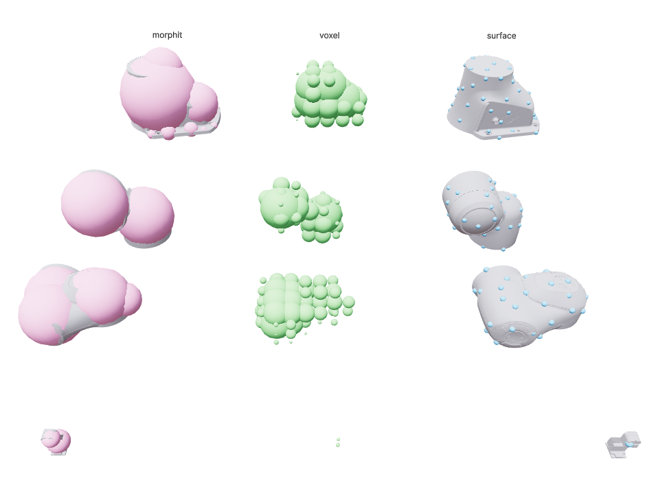

.. _sphere_fitting_note:

Fitting Spheres to Geometry
==================================

cuRobo represents robots and grasped objects as sets of spheres for collision checking.
This page describes the available sphere fitting techniques.

.. _attach_object_note:

Use Cases
----------

- **Grasped objects**: During pick-and-place, the grasped object must be checked for collisions
  with the world. cuRobo approximates it as spheres and attaches them to the robot's kinematic
  model.
- **Robot links**: Robot geometry is approximated with spheres for self-collision and world
  collision checking. See :ref:`tutorial_build_robot_model` for configuring robot spheres.

Entry Point
-----------

The main function is :func:`curobo.geom.sphere_fit.fit_spheres_to_mesh`:

.. code-block:: python

   from curobo.geom.sphere_fit import fit_spheres_to_mesh, SphereFitType
   import trimesh

   mesh = trimesh.load("my_object.obj")

   # Automatic sphere count with default density
   result = fit_spheres_to_mesh(mesh)

   # Explicit sphere count
   result = fit_spheres_to_mesh(mesh, n_spheres=50)

   # With quality metrics
   result = fit_spheres_to_mesh(mesh, compute_metrics=True)
   print(f"Coverage: {result.metrics.coverage:.2%}, Protrusion: {result.metrics.protrusion:.2%}")

.. list-table:: Parameters
   :header-rows: 1
   :widths: 25 75

   * - Parameter
     - Description
   * - ``n_spheres``
     - Number of spheres to fit. When ``None``, estimated automatically from
       bounding-box volume and ``sphere_density``.
   * - ``sphere_density``
     - Density multiplier for auto sphere count (default ``1.0``).
       ``2.0`` doubles the count, ``0.5`` halves it. Range: ``0.1`` -- ``10.0``.
   * - ``fit_type``
     - Fitting algorithm (default ``MORPHIT``). See below.
   * - ``surface_radius``
     - Radius for surface-sampled spheres. Only affects ``SURFACE`` fit type.
   * - ``iterations``
     - Optimization iterations for ``MORPHIT`` (default ``50``).
   * - ``compute_metrics``
     - When ``True``, populates quality metrics on the result.
   * - ``clip_plane``
     - Half-plane constraint ``((nx, ny, nz), offset)`` in mesh-local coordinates.
       Spheres that cross the plane are penalised during MorphIt optimization and
       hard-clamped afterwards.  Useful for keeping base-link spheres from
       protruding into a mounting surface.

Fit Types
----------

cuRobo provides three methods via :class:`curobo.geom.sphere_fit.SphereFitType`:

.. list-table::
   :header-rows: 1
   :widths: 20 80

   * - Type
     - Description
   * - ``SURFACE``
     - Samples the mesh surface evenly with fixed-radius spheres. Fast fallback
       for thin or degenerate meshes.
   * - ``VOXEL``
     - Voxelizes the bounding box, filters by SDF to keep interior voxels, and
       assigns inscribed radii. Good for convex shapes.
   * - ``MORPHIT``
     - Initialises with ``VOXEL``, then runs Adam optimization to minimise
       coverage gaps and protrusion. Best quality, recommended default.

   Comparison of the three fit types on robot link meshes. From left to right:
   MORPHIT (pink), VOXEL (green), SURFACE (blue).

To visually compare the fit types interactively, run the comparison demo:

.. code-block:: bash

   python -m curobo.examples.reference.sphere_fit_comparison

This launches a `Viser <https://viser.studio>`_ viewer showing each fit type as a column of
coloured spheres next to the original mesh. You can customise the robot, links, and methods:

.. code-block:: bash

   python -m curobo.examples.reference.sphere_fit_comparison --robot franka.yml
   python -m curobo.examples.reference.sphere_fit_comparison --links panda_link0 panda_link7
   python -m curobo.examples.reference.sphere_fit_comparison --methods surface voxel morphit

The fitting pipeline automatically handles degenerate cases:

- **Hollow/thin meshes**: Watertight meshes with extremely low fill ratio are replaced
  with their convex hull before fitting.
- **Fallback chain**: If the primary method produces no spheres, falls back to ``VOXEL``,
  then ``SURFACE``.

Result
-------

:class:`curobo.geom.sphere_fit.SphereFitResult` contains:

.. list-table::
   :header-rows: 1
   :widths: 25 75

   * - Field
     - Description
   * - ``centers``
     - Sphere centre positions, shape ``(N, 3)``.
   * - ``radii``
     - Sphere radii, shape ``(N,)``.
   * - ``n_spheres``
     - Number of fitted spheres.
   * - ``fit_time_s``
     - Wall-clock fitting time in seconds.

Quality Metrics
----------------

When ``compute_metrics=True``, the following fields are populated:

.. list-table::
   :header-rows: 1
   :widths: 25 75

   * - Metric
     - Description
   * - ``coverage``
     - Fraction of interior sample points covered by at least one sphere.
   * - ``protrusion``
     - Fraction of sphere-surface sample points outside the mesh.
   * - ``protrusion_dist_mean``
     - Mean distance (m) of protruding points to the mesh surface.
   * - ``protrusion_dist_p95``
     - 95th-percentile protrusion distance (m).
   * - ``surface_gap_mean``
     - Mean gap (m) from mesh surface samples to nearest sphere surface.
   * - ``surface_gap_p95``
     - 95th-percentile surface gap (m).
   * - ``max_uncovered_gap``
     - Maximum gap (m) from mesh surface to nearest sphere.
   * - ``volume_ratio``
     - Total sphere volume divided by mesh volume.

Inspecting Fit Quality
-----------------------

Pass ``--compute-metrics`` to the robot builder script to print a per-link
quality report after sphere fitting:

.. code-block:: bash

   python -m curobo.examples.getting_started.build_robot_model \
       --urdf robot.urdf --asset-path meshes/ --output robot.yml \
       --compute-metrics

The same metrics are available programmatically via
``builder.link_metrics`` (a dict of :class:`SphereFitMetrics`).

Clip Planes
------------

When a robot is mounted on a stand or bolted to the floor, base-link spheres
may protrude into the mounting surface.  Pass ``--clip-link`` to prevent this:

.. code-block:: bash

   python -m curobo.examples.getting_started.build_robot_model \
       --urdf robot.urdf --asset-path meshes/ --output robot.yml \
       --clip-link base_link z 0.0

This adds a half-plane constraint during MorphIt optimization (as a
differentiable loss term) and applies a hard clamp after fitting, so no sphere
on ``base_link`` extends below ``z=0`` in link-local coordinates.  The flag can
be repeated for multiple links.

Programmatically, pass ``clip_links`` to :meth:`RobotBuilder.fit_collision_spheres`:

.. code-block:: python

   builder.fit_collision_spheres(clip_links={"base_link": ("z", 0.0)})

Geometry Helper
----------------

Individual geometry objects also provide a convenience method for sphere fitting:

.. code-block:: python

   from curobo.geom.types import Capsule, WorldCfg

   capsule = Capsule(
      name="capsule",
      radius=0.2,
      base=[0, 0, 0],
      tip=[0, 0, 0.5],
      pose=[0.0, 5, 0.0, 0.043, -0.471, 0.284, 0.834],
   )

   sph = capsule.get_bounding_spheres(n_spheres=500)
   WorldCfg(spheres=sph).save_world_as_mesh("bounding_spheres.obj")
